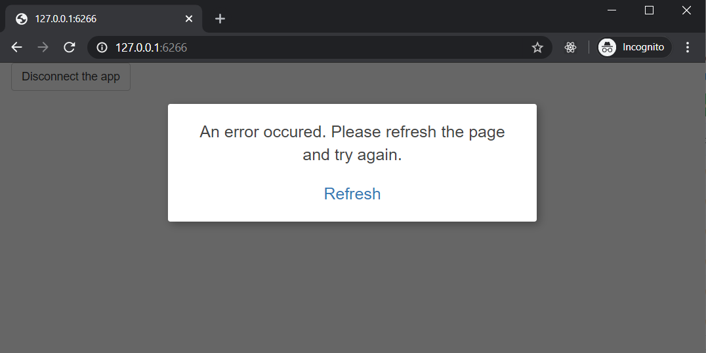
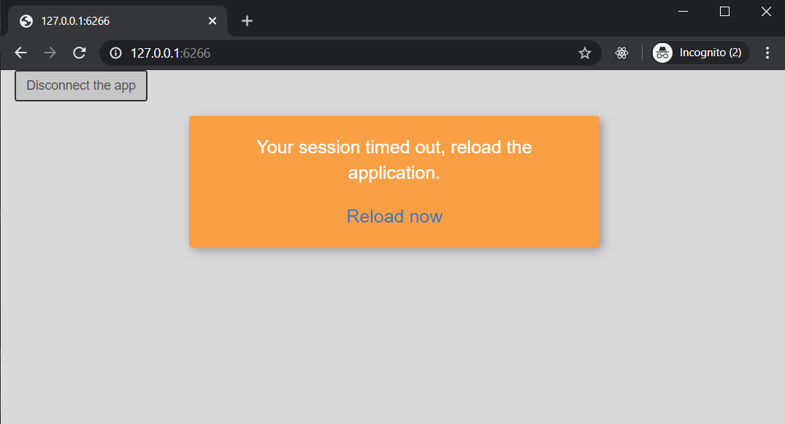

# shinydisconnect - Show a nice message when a Shiny app disconnects or errors

[](https://cran.r-project.org/package=shinydisconnect)

> Copyright 2020 [Dean Attali](https://deanattali.com). Licensed under the MIT license.

A shiny app can disconnect for a variety of reasons: an unrecoverable error occurred in the app, the server went down, the user's internet connection died, or any other reason that might cause the shiny app to lose connection to its server.

`shinydisconnect` allows you to add a nice message to the user when the app disconnects.  The message works both locally (running Shiny apps within RStudio) and on Shiny servers (such as shinyapps.io, RStudio Connect, Shiny Server Open Source, Shiny Server Pro). See the [demo Shiny app](https://daattali.com/shiny/shinydisconnect-demo/) online for examples.

**If you find shinydisconnect useful, please consider supporting my work\!**

<p align="center">

<a style="display: inline-block;" href="https://paypal.me/daattali">

</a>
<a style="display: inline-block; margin-left: 10px;" href="https://github.com/sponsors/daattali">
 </a>

</p>

## Examples

Example 1: basic usage ([code](inst/examples/basic/app.R))



Example 2: using parameters ([code](inst/examples/advanced/app.R))



Example 3: full-width and vertically centered ([code](inst/examples/special/app.R))


## Installation

The package is not yet on CRAN, so to install use these comments:

```
install.packages("remotes")
remotes::install_github("daattali/shinydisconnect")
```

## How to use

Call `disonnectMessage()` anywhere in a Shiny app's UI to add a nice message when a shiny app disconnects. `disonnectMessage()` has parameters to modify the text, position, and colours of the disconnect message.

Without using this package, a shiny app that disconnects will either just show a greyed out screen if running locally (with no message), or will show a small message in the bottom-left corner that you cannot modify when running in a server.

Basic usage:

```
ui <- fluidPage(
  disconnectMessage(),
  actionButton("disconnect", "Disconnect the app")
)
server <- function(input, output, session) {
  observeEvent(input$disconnect, {
    session$close()
  })
}
shinyApp(ui, server)
```
