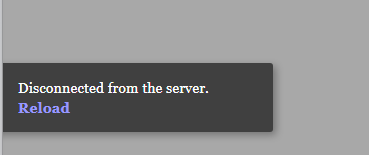
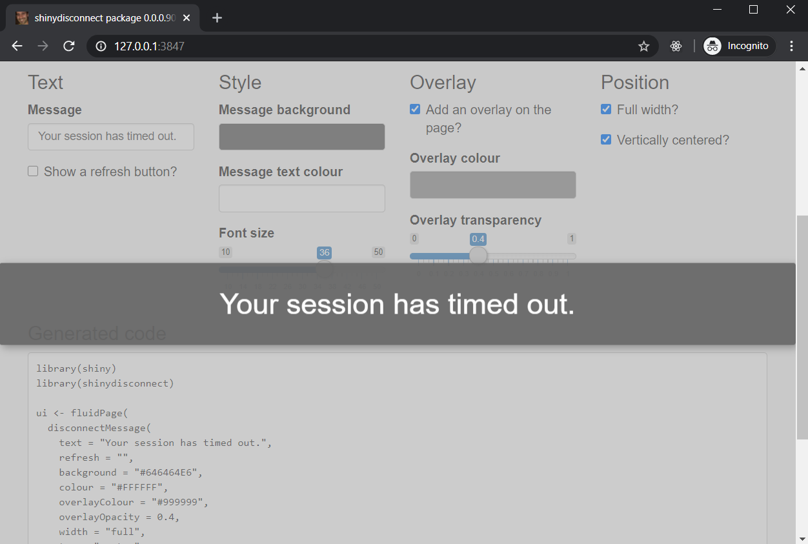

# {shinydisconnect} - Show a nice message when a Shiny app disconnects or errors

[](https://cran.r-project.org/package=shinydisconnect)
[](https://github.com/daattali/shinydisconnect/actions)


> [Demo](https://daattali.com/shiny/shinydisconnect-demo/) &middot; Created by [Dean Attali](https://deanattali.com)

A shiny app can disconnect for a variety of reasons: an unrecoverable error occurred in the app, the server went down, the user lost internet connection, or any other reason that might cause the shiny app to lose connection to its server.

{shinydisconnect} allows you to add a nice message to the user when the app disconnects.  The message works both locally (running Shiny apps within RStudio) and on Shiny servers (such as shinyapps.io, RStudio Connect, Shiny Server Open Source, Shiny Server Pro). See the [demo Shiny app](https://daattali.com/shiny/shinydisconnect-demo/) online for examples.

**Need Shiny help? [I’m available for consulting](https://attalitech.com/).**<br/>
**If you find {shinydisconnect} useful, please consider [supporting my work](https://github.com/sponsors/daattali/sponsorships?tier_id=39852) to unlock rewards\! ❤**

<p align="center">

<a style="display: inline-block; margin-left: 10px;" href="https://github.com/sponsors/daattali/sponsorships?tier_id=39852">
 </a>

<a style="display: inline-block;" href="https://paypal.me/daattali">

</a>

</p>

> This package is part of a larger ecosystem of packages with a shared vision: solving common Shiny issues and improving Shiny apps with minimal effort, minimal code changes, and straightforward documentation. Other packages for your Shiny apps:

| Package | Description | Demo |
|---|---|---|
| [shinyjs](https://deanattali.com/shinyjs/) | 💡 Easily improve the user experience of your Shiny apps in seconds | [🔗](https://deanattali.com/shinyjs/overview#demo) |
| [shinyalert](https://github.com/daattali/shinyalert) | 🗯️ Easily create pretty popup messages (modals) in Shiny | [🔗](https://daattali.com/shiny/shinyalert-demo/) |
| [shinyscreenshot](https://github.com/daattali/shinyscreenshot/) | 📷 Capture screenshots of entire pages or parts of pages in Shiny apps | [🔗](https://daattali.com/shiny/shinyscreenshot-demo/) |
| [timevis](https://github.com/daattali/timevis/) | 📅 Create interactive timeline visualizations in R | [🔗](https://daattali.com/shiny/timevis-demo/) |
| [shinycssloaders](https://github.com/daattali/shinycssloaders/) | ⌛ Add loading animations to a Shiny output while it's recalculating | [🔗](https://daattali.com/shiny/shinycssloaders-demo/) |
| [colourpicker](https://github.com/daattali/colourpicker/) | 🎨 A colour picker tool for Shiny and for selecting colours in plots | [🔗](https://daattali.com/shiny/colourInput/) |
| [shinybrowser](https://github.com/daattali/shinybrowser/) | 🌐 Find out information about a user's web browser in Shiny apps | [🔗](https://daattali.com/shiny/shinybrowser-demo/) |
| [shinyforms](https://github.com/daattali/shinyforms/) | 📝 Easily create questionnaire-type forms with Shiny | WIP |

# Table of contents

- [The problem](#problem)
- [Examples](#examples)
- [Installation](#install)
- [How to use](#usage)
- [Sponsors 🏆](#sponsors)

<h2 id="problem">The problem</h2>

Have you ever noticed how an error in your Shiny app looks very different when it happens locally (in RStudio on your laptop) compared to when it happens in production (in shinyapps.io or Shiny Server or Connect)? Locally, when a Shiny app breaks, you just get a grey screen. But when a deployed app breaks, you also get a little strip that says "Disconnected from server. Reload."



You don't have any control over that message's text or position, and you don't have a way to get that message to appear both locally and in deployed apps.

Well, at least you didn't until now. {shinydisconnect} solves exactly these two issues, by allowing you to show a customized (and pretty!) message when a Shiny app disconnects or errors, regardless of where the app is running.

<h2 id="examples">Examples</h2>

For interactive examples and to see all the features, [check out the demo app](https://daattali.com/shiny/shinydisconnect-demo/).

**Example 1: basic usage ([code](inst/examples/basic/app.R))**


**Example 2: using parameters ([code](inst/examples/advanced/app.R))**


**Example 3: full-width and vertically centered ([code](inst/examples/special/app.R))**

You can also use `disconnectMessage2()` to get a similar message box to this one.



**Example 4: hide the app**

This can be achieved by setting the opacity to 1 (fully opaque).


<h2 id="install">Installation</h2>

To install the stable CRAN version:

```
install.packages("shinydisconnect")
```

To install the latest development version from GitHub:

```
install.packages("remotes")
remotes::install_github("daattali/shinydisconnect")
```

<h2 id="usage">How to use</h2>

The package only has two functions: `disconnectMessage()` and `disconnectMessage2()`.

Call `disconnectMessage()` anywhere in a Shiny app's UI to add a nice message when a shiny app disconnects. `disconnectMessage()` has many parameters to modify the text, position, and colours of the disconnect message.

Note that it's not possible to distinguish between errors and timeouts - they will both show the same message.

Without using this package, a shiny app that disconnects will either just show a greyed out screen if running locally (with no message), or will show a small message in the bottom-left corner that you cannot modify when running in a server.

Basic usage:

```
ui <- fluidPage(
  disconnectMessage(),
  actionButton("disconnect", "Disconnect the app")
)
server <- function(input, output, session) {
  observeEvent(input$disconnect, {
    session$close()
  })
}
shinyApp(ui, server)
```

You can use `disconnectMessage2()` as a pre-configured version of `disconnectMessage()` with a specific set of parameters.

<h2 id="sponsors">

Sponsors 🏆

</h2>

> There are no sponsors yet

[Become the first sponsor for
{shinydisconnect}\!](https://github.com/sponsors/daattali/sponsorships?tier_id=39856)
